# 전사 업무 지원 Multi-Domain RAG 챗봇 서비스

---

## 1. 프로젝트 개요

### a. 프로젝트 이름
전사 업무 지원 Multi-Domain RAG 챗봇 서비스

### b. 프로젝트 유형
개인 프로젝트

### c. 담당 역할
- 전체 시스템 설계 및 아키텍처 구성
- 멀티 도메인 Chroma 벡터 DB 구성 및 RAG 파이프라인 구축
- Streamlit 프론트엔드 UI 개발
- Docker 기반 컨테이너 환경 구성

### d. 사용 기술 스택 (Tech Stack)

| 구분 | 기술 |
|------|------|
| 언어 | Python 3.11 |
| AI 오케스트레이션 | LangGraph |
| RAG 프레임워크 | LangChain |
| LLM | OpenAI gpt-4o-mini |
| 임베딩 | OpenAI text-embedding-3-small |
| 벡터 DB | Chroma |
| 백엔드 | FastAPI |
| 프론트엔드 | Streamlit |
| 인프라 | Docker |

### e. 한 줄 설명
사용자 질문을 자동으로 5개 업무 도메인 중 한 개로 분류하고 도메인별 사내 지식 문서를 RAG로 검색해 즉각 답변하는 전사 AI 챗봇 서비스

---

## 2. 문제 정의 및 접근 방식

### a. 해결하려는 문제
현장 작업자, 일반 직원, 영업 담당자, 신입 사원 등 다양한 직군이 업무 중 발생하는 질문을 담당 부서나 담당자에게 매번 문의해야 하는 비효율이 존재했다. 특히 아래 상황이 반복적으로 발생했다.

- 현장 작업자: 설비 이상 및 에러 코드 발생 시 매뉴얼을 직접 뒤져야 함
- 일반 직원: 연차, 출장비, 재택근무 등의 인사 규정을 몰라 HR 부서에 반복 문의
- IT 장애: VPN, SAP, 메일 오류 발생 시 헬프데스크 대기 시간 발생
- 영업 담당자: 제품 스펙, 경쟁사 비교 자료를 실시간으로 참고하기 어려움
- 신입 직원: 공정 흐름, 품질 기준 등 온보딩 사항 접근 경로 불명확

### b. 기존 방식의 한계

| 기존 문제 | 한계 |
|-----------|------|
| 담당 부서 직접 문의 | 응답 지연, 반복 업무 발생 |
| 방대한 사내 문서 직접 검색 | 원하는 정보를 찾기 어렵고 시간 소요 |
| 도메인별 담당자가 달라 어디에 물어볼지 모름 | 잘못된 부서로 문의 후 재문의 발생 |
| 현장 작업자가 설비 사진으로 상황 설명 불가 | 원격 지원 한계 |
| 지식 문서 업데이트 시 전파 지연 | 최신 정보 반영 어려움 |

### c. 솔루션 및 핵심 아이디어
- **LLM 기반 자동 도메인 라우팅**: 사용자가 도메인을 직접 선택하지 않아도 질문 의도를 LLM이 파악하여 5개 도메인 중 적합한 RAG 파이프라인으로 자동 연결
- **도메인별 독립 RAG 파이프라인**: 각 업무 도메인의 지식 문서를 Chroma 컬렉션으로 독립 관리, 도메인 간 간섭 없이 정확한 문서 검색
- **LangGraph 상태 그래프**: router → retriever → generator 3단계 노드 파이프라인으로 대화 상태(domain, context, sources)를 명시적으로 관리
- **멀티모달 지원**: 현장 사진을 Base64로 인코딩하여 LLM이 텍스트와 이미지를 함께 분석

---

## 3. 구현

### a. 시스템 아키텍처

```
사용자 질문 (텍스트 + 선택적 이미지)
        │
        ▼
  [Streamlit 프론트엔드]
  - 도메인 배지 표시
  - 참고 문서 출처 표시
  - 이미지 업로드 (Base64 인코딩)
        │ POST /chat
        ▼
  [FastAPI 백엔드]
        │
        ▼
  [LangGraph 파이프라인]
  ┌─────────────────────────────┐
  │ router_node                 │
  │  LLM 기반 도메인 분류        │
  │  + 키워드 폴백 분류           │
  └────────────┬────────────────┘
               │ domain 결정
               ▼
  ┌─────────────────────────────┐
  │ retriever_node              │
  │  Chroma 벡터 DB 검색         │
  │  도메인별 컬렉션에서 Top-K 문서│
  └────────────┬────────────────┘
               │ context + sources
               ▼
  ┌─────────────────────────────┐
  │ generator_node              │
  │  도메인 전용 System Prompt   │
  │  LLM 답변 생성               │
  └────────────┬────────────────┘
               │
               ▼
  {reply, domain, sources} → 프론트엔드 응답
```

### b. 데이터 파이프라인

```
지식 문서(.txt)
    │
    ▼
TextLoader (LangChain)
    │
    ▼
RecursiveCharacterTextSplitter
(chunk_size=500, overlap=80)
    │
    ▼
OpenAI Embedding
(text-embedding-3-small)
    │
    ▼
Chroma 벡터 DB
(도메인별 독립 컬렉션)
    │
    ▼
유사도 검색 → Top-K 문서 반환
```

**도메인별 지식 문서 구성 (총 10개)**

| 도메인 | 파일 | 내용 |
|--------|------|------|
| manual | equipment_manual.txt | PA-100 장비 사양, 알람 코드, 필터 교체 주기 |
| manual | safety_manual.txt | LOTO 절차, 안전 수칙, PPE 기준 |
| manual | troubleshooting.txt | 에러 코드(E-201~E-205) 조치 절차 |
| hr | hr_policy.txt | 근무 시간, 복지, 인사 규정 |
| hr | expense_policy.txt | 국내/해외 출장비 기준, 경비 처리 절차 |
| hr | vacation_policy.txt | 연차 발생/이월/수당, 재택근무 규정 |
| it | vpn_troubleshooting.txt | VPN 오류 유형별 해결 방법 |
| it | email_issue.txt | 메일 용량 관리, SAP 로그인 문제 |
| sales | product_info.txt | A/B 제품 스펙, 가격, 특징 |
| sales | competitor_analysis.txt | 경쟁사 대비 강약점, 대응 전략 |
| education | training_manual.txt | 신입 온보딩 절차, 사내 시스템 사용법 |
| education | process_guide.txt | 생산 공정 흐름, 품질 검사 기준 |

### c. 주요 기능 설명

1. **자동 도메인 라우팅**: 사용자 질문을 LLM이 5개 도메인(현장 매뉴얼 / HR / IT / 영업 / 교육) 중 하나로 자동 분류
2. **도메인별 RAG 답변**: 해당 도메인의 지식 문서에서 관련 청크를 검색하여 정확한 답변 생성
3. **참고 문서 출처 표시**: 모든 응답에 답변 근거가 된 지식 문서 파일명 제공
4. **멀티모달 지원**: 현장 사진 업로드 → LLM이 텍스트와 이미지를 함께 분석하여 답변
5. **대화 컨텍스트 유지**: Thread ID 기반 세션 관리로 멀티턴 대화 지원
6. **Docker 기반 배포**: 단일 명령으로 백엔드·프론트엔드·벡터 DB 전체 실행

### d. 핵심 알고리즘 / 로직

**LLM 기반 도메인 라우터 (이중 안전장치)**

```python
def classify_domain(query: str) -> str:
    # 1차: LLM이 도메인 키 하나만 출력하도록 강제하는 System Prompt
    response = _router_llm.invoke([("system", _ROUTER_SYSTEM), ("human", query)])
    domain = response.content.strip().lower()

    # 2차: LLM 응답이 유효하지 않으면 키워드 매칭으로 폴백
    if domain not in valid_domains:
        domain = _keyword_fallback(query)
    return domain
```

**LangGraph 상태 그래프 (ChatState)**

```python
class ChatState(TypedDict):
    messages: Annotated[List[BaseMessage], add_messages]  # 대화 이력
    domain: str        # 분류된 도메인 키
    context: str       # 검색된 문서 텍스트
    sources: List[str] # 참고 문서 파일명 목록
```

### e. 데이터 처리 방식

- **청킹**: RecursiveCharacterTextSplitter (chunk_size=500, overlap=80)로 문서를 의미 단위로 분할
- **임베딩**: OpenAI text-embedding-3-small로 청크를 벡터화
- **저장**: Chroma 도메인별 독립 컬렉션 (`rag_manual`, `rag_hr`, `rag_it`, `rag_sales`, `rag_education`)
- **캐싱**: `_retrievers` 딕셔너리로 메모리 캐시 구성 → 중복 벡터 DB 로드 방지
- **검색**: 유사도 기반 Top-K 문서 검색

### f. 주요 코드 구조

```
langgraph-rag-service/
├── backend/
│   ├── app/
│   │   ├── graph.py      # LangGraph 3-노드 파이프라인
│   │   ├── router.py     # LLM 도메인 분류 + 키워드 폴백
│   │   ├── rag.py        # 멀티 도메인 Chroma 벡터 스토어
│   │   ├── tools.py      # 도메인별 RAG 도구 (에이전트 확장용)
│   │   └── config.py     # 환경 변수 설정
│   ├── knowledge/        # 도메인별 지식 문서
│   │   ├── manual/
│   │   ├── hr/
│   │   ├── it/
│   │   ├── sales/
│   │   └── education/
│   └── main.py           # FastAPI 앱 진입점
├── frontend/
│   └── streamlit_app.py  # 챗봇 UI
├── tests/
│   └── test_scenarios.md # 테스트 시나리오 문서
└── docker-compose.yml
```

### g. 성능 최적화 방법

- **검색기 메모리 캐싱**: 벡터 DB를 최초 1회만 로드하고 `_retrievers` 딕셔너리에 캐싱하여 이후 요청에서 재사용
- **도메인별 컬렉션 분리**: 단일 컬렉션 전체 검색 대신 도메인별 독립 컬렉션으로 검색 범위 최소화 → 검색 속도 및 정확도 향상
- **청크 크기 최적화**: chunk_size=500, overlap=80으로 설정해 문맥 손실 없이 검색 정밀도 확보
- **Docker 헬스 체크**: 백엔드 준비 완료 후 프론트엔드가 시작되는 `depends_on` + `service_healthy` 설정으로 안정적인 서비스 기동

### h. 문제 해결 과정

**문제 1: LLM 라우터가 예상치 못한 텍스트를 반환하는 경우**
- 원인: LLM이 도메인 키 외에 부연 설명을 추가하거나 존재하지 않는 도메인명을 출력
- 해결: LLM 응답 유효성 검사 후 유효하지 않으면 한국어 키워드 매칭(`_keyword_fallback`)으로 폴백하는 이중 안전장치 구현

**문제 2: 멀티모달 메시지 파싱 오류**
- 원인: 이미지가 첨부된 HumanMessage의 content가 리스트 형태로 전달되어 텍스트 추출 실패
- 해결: `_get_last_human_text()` 함수에서 content 타입을 확인 후 리스트이면 `type: "text"` 파트만 추출하는 로직 추가

**문제 3: 벡터 DB 중복 로드 문제**
- 원인: 요청마다 Chroma 컬렉션을 새로 로드하면서 메모리 및 시간 낭비 발생
- 해결: `_retrievers` 딕셔너리 캐시를 통해 최초 1회 로드 후 재사용

---

## 4. 결과

### a. 주요 결과 (지표, 성능)

| 지표 | 결과 |
|------|------|
| 도메인 라우팅 정확도 | **13/13 (100%)** — 목표치 90% 초과 달성 |
| 구현 요구사항 달성률 | **14/14 (100%)** |
| 지원 도메인 수 | 5개 (현장 매뉴얼 / HR / IT / 영업 / 교육) |
| 지식 문서 수 | 10개 |
| 테스트 케이스 수 | 13개 (전 케이스 통과) |

### b. 이전 대비 개선 사항

| 항목 | 이전 (단일 LLM 호출) | 이후 (LangGraph RAG) |
|------|---------------------|---------------------|
| 답변 근거 | 모델 학습 데이터 기반 (hallucination 위험) | 실제 사내 지식 문서 기반 |
| 도메인 처리 | 단일 응답 | 5개 도메인 자동 라우팅 |
| 출처 투명성 | 없음 | 참고 문서 파일명 제공 |
| 이미지 분석 | 불가 | 현장 사진 업로드 및 멀티모달 분석 |
| 지식 업데이트 | 모델 재훈련 필요 | 지식 문서 교체만으로 즉시 반영 |

### d. 스크린샷

### 테스트 결과 화면 설명

### 초기 화면 (`첫인사.png`)

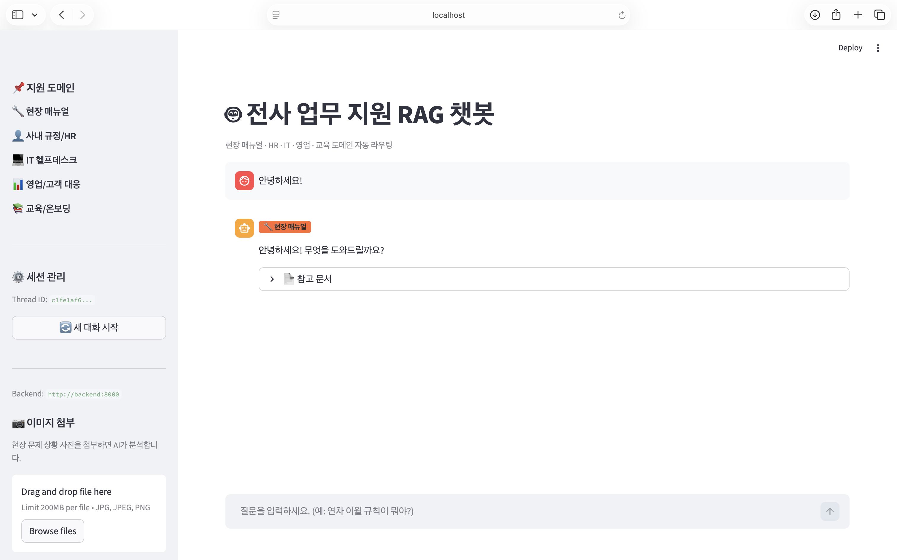

서비스 최초 접속 시의 화면이다.

- **좌측 사이드바**: 지원 도메인 목록(현장 매뉴얼, 사내 규정/HR, IT 헬프데스크, 영업/고객 대응, 교육/온보딩), 세션 Thread ID, 새 대화 시작 버튼, 이미지 첨부 영역이 표시된다.
- **중앙 채팅 영역**: "전사 업무 지원 RAG 챗봇" 타이틀과 함께 도메인 자동 라우팅 안내 캡션이 표시된다. 사용자가 "안녕하세요!"로 인사하자 챗봇이 `🔧 현장 매뉴얼` 도메인 배지와 함께 응답한 모습이다.
- **하단**: 질문 입력창이 위치하며 예시 질문이 placeholder로 안내된다.

---

### 사내 규정/HR 도메인 테스트

#### 출장비 규정 (`HR_1.png`)

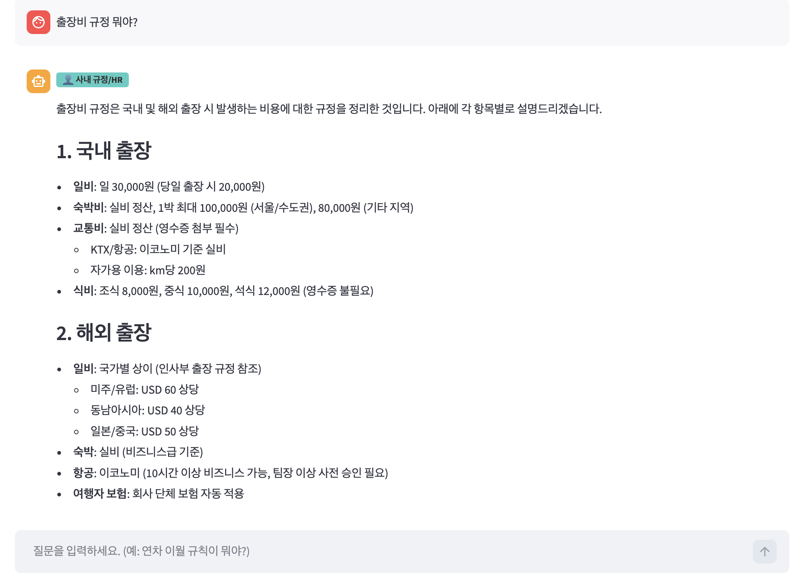

**입력:** "출장비 규정 뭐야?"

- **라우팅 결과**: `사내 규정/HR` 도메인으로 정확히 분류
- **답변 내용**: 국내/해외 출장비 규정을 구조화된 형식으로 상세 안내
  - 국내: 일비 30,000원, 숙박비 실비(서울 최대 100,000원), 교통비 실비, 식비 항목별 기준
  - 해외: 지역별 일비(미주/유럽 USD 60, 동남아 USD 40, 일본/중국 USD 50), 항공/보험 규정
- **검증**: `expense_policy.txt` 지식 문서 기반으로 정확한 수치 데이터 포함

---

#### 연차 이월 규칙 (`HR_2.png`)

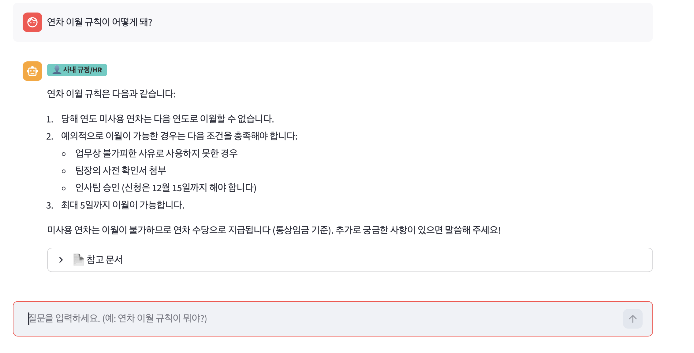

**입력:** "연차 이월 규칙이 어떻게 돼?"

- **라우팅 결과**: `사내 규정/HR` 도메인으로 정확히 분류
- **답변 내용**:
  1. 당해 연도 미사용 연차는 원칙적으로 이월 불가
  2. 예외 조건(업무상 불가피한 사유, 팀장 확인서, 인사팀 승인, 12월 15일까지 신청) 안내
  3. 최대 5일 이월 가능, 미사용 연차는 연차 수당으로 지급(통상임금 기준)
- **하단 `참고 문서` 접기/펼치기 UI**: 답변 근거 문서를 확인할 수 있는 expander 컴포넌트 구현

---

#### 재택근무 신청 절차 (`HR_3.png`)

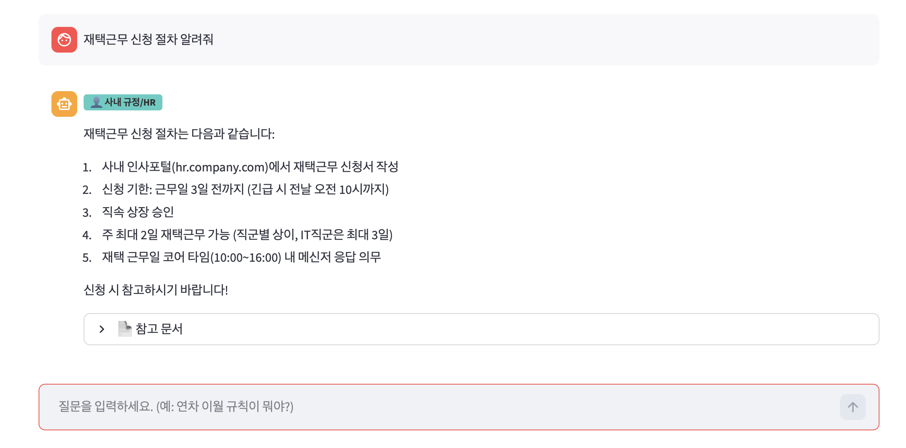

**입력:** "재택근무 신청 절차 알려줘"

- **라우팅 결과**: `사내 규정/HR` 도메인으로 정확히 분류
- **답변 내용**: 5단계 절차를 번호 목록으로 안내
  1. 사내 인사포털(hr.company.com)에서 재택근무 신청서 작성
  2. 신청 기한: 근무일 3일 전(긴급 시 전날 오전 10시)
  3. 직속 상장 승인
  4. 주 최대 2일(IT직군 최대 3일)
  5. 코어 타임(10:00~16:00) 내 메신저 응답 의무

---

### IT 헬프데스크 도메인 테스트

#### VPN 접속 문제 (`IT_1.png`)

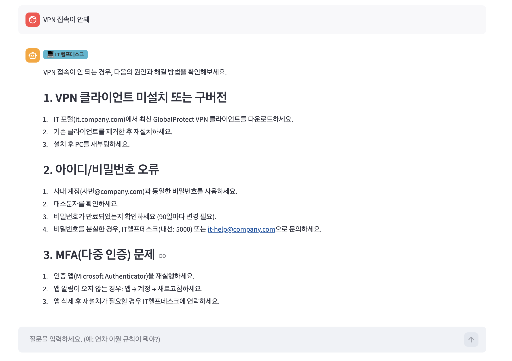

**입력:** "VPN 접속이 안돼"

- **라우팅 결과**: `IT 헬프데스크` 도메인으로 정확히 분류
- **답변 내용**: 원인별 해결 방법을 헤더로 구분하여 안내
  - VPN 클라이언트 미설치/구버전: GlobalProtect 재설치 절차
  - 아이디/비밀번호 오류: 사내 계정 동일 비밀번호, 90일 변경 주기, IT헬프데스크(내선 5000) 안내
  - MFA(다중 인증) 문제: Microsoft Authenticator 재실행 및 재설치 방법

---

#### SAP 로그인 잠금 (`IT_2.png`)

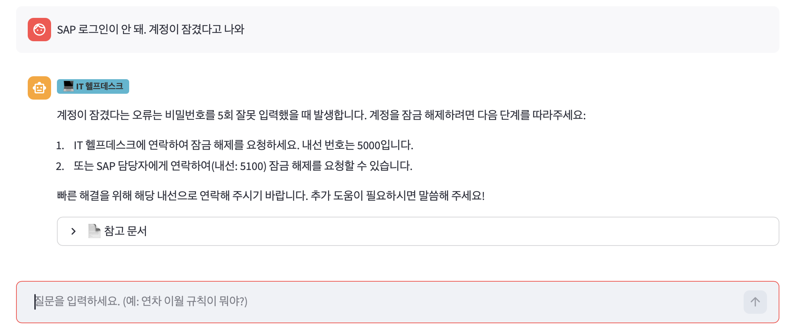

**입력:** "SAP 로그인이 안 돼. 계정이 잠겼다고 나와"

- **라우팅 결과**: `IT 헬프데스크` 도메인으로 정확히 분류
- **답변 내용**: 비밀번호 5회 오류로 계정 잠금 발생 원인 설명 및 해제 방법(IT헬프데스크 내선 5000, SAP 담당자 내선 5100)을 간결하게 안내
- **특징**: 해결 불가 시 담당자 연락 정보를 구체적인 내선 번호와 함께 제공하는 설계가 반영됨

---

#### 메일 용량 초과 (`IT_3.png`)

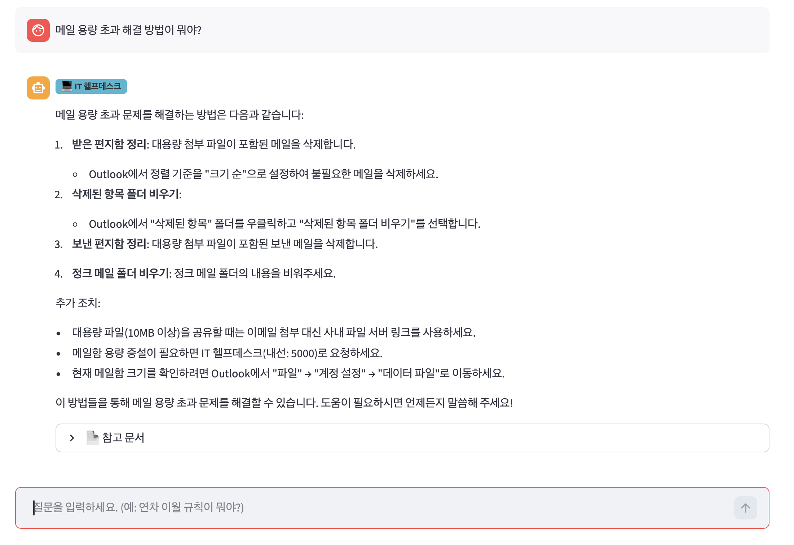

**입력:** "메일 용량 초과 해결 방법이 뭐야?"

- **라우팅 결과**: `IT 헬프데스크` 도메인으로 정확히 분류
- **답변 내용**: 4단계 정리 방법(받은 편지함·삭제된 항목·보낸 편지함·정크 메일 정리) + 추가 조치(10MB 이상 파일은 사내 파일 서버 링크 활용, 용량 증설 신청 방법, 현재 용량 확인 경로) 상세 안내

---

### 영업/고객 대응 도메인 테스트

#### A제품 vs B제품 비교 (`고객대응_1.png`)

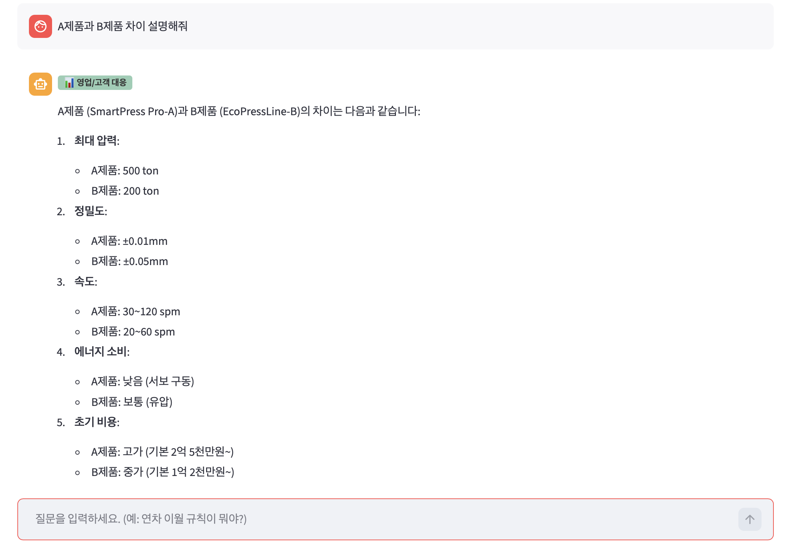

**입력:** "A제품과 B제품 차이 설명해줘"

- **라우팅 결과**: `영업/고객 대응` 도메인으로 정확히 분류
- **답변 내용**: SmartPress Pro-A와 EcoPressLine-B의 5개 항목 비교
  - 최대 압력: 500 ton vs 200 ton
  - 정밀도: ±0.01mm vs ±0.05mm
  - 속도: 30~120 spm vs 20~60 spm
  - 에너지 소비: 낮음(서보 구동) vs 보통(유압)
  - 초기 비용: 2억 5천만 원~ vs 1억 2천만 원~

---

#### 고객 경쟁사 비교 요청 대응 (`고객대응_2.png`)

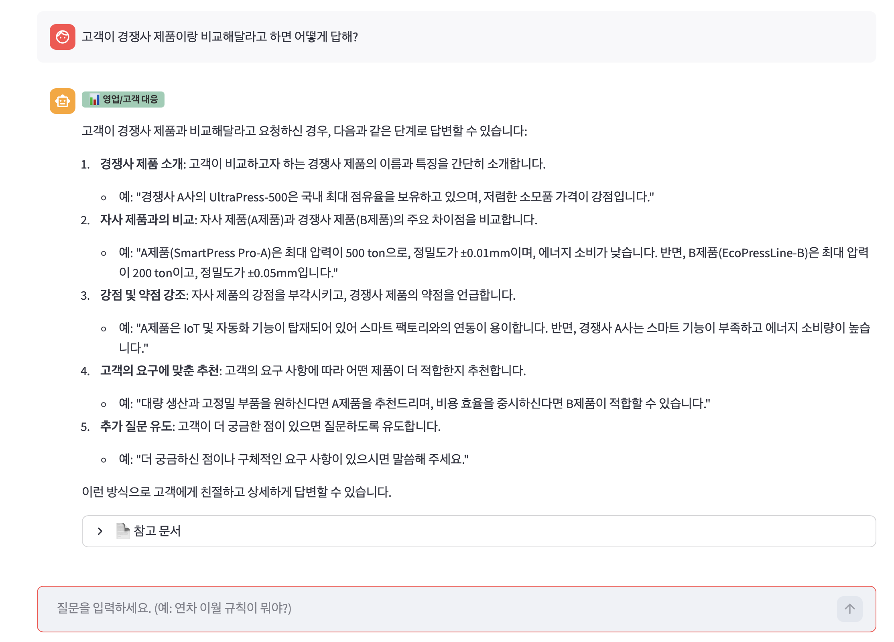

**입력:** "고객이 경쟁사 제품이랑 비교해달라고 하면 어떻게 답해?"

- **라우팅 결과**: `영업/고객 대응` 도메인으로 정확히 분류
- **답변 내용**: 고객 응대 5단계 전략 제시
  1. 경쟁사 제품 소개(객관적 특징 언급)
  2. 자사 제품과의 비교(스펙 기반)
  3. 강점 부각 + 경쟁사 약점 언급
  4. 고객 요구에 맞춘 추천
  5. 추가 질문 유도
- **특징**: 단순 정보 검색을 넘어 영업 담당자가 실제로 활용할 수 있는 대응 전략을 제시함

---

### 교육/온보딩 도메인 테스트

#### 품질 검사 기준 (`교육_1.png`)

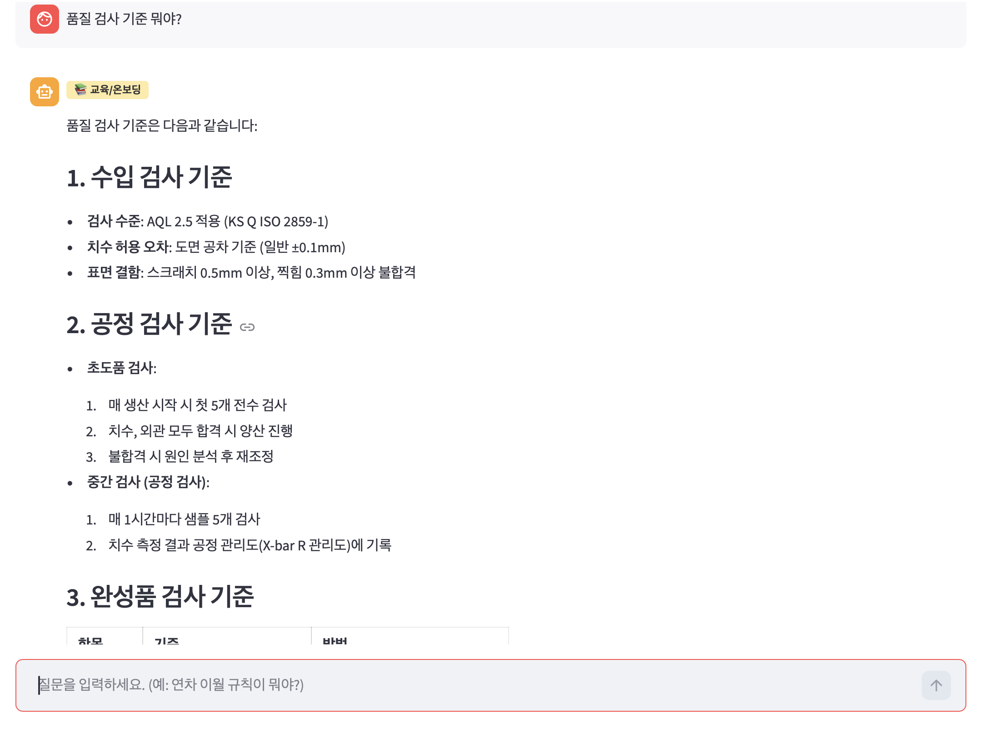

**입력:** "품질 검사 기준 뭐야?"

- **라우팅 결과**: `교육/온보딩` 도메인으로 정확히 분류
- **답변 내용**: 3단계 검사 기준을 구조화하여 안내
  - 수입 검사: AQL 2.5 적용(KS Q ISO 2859-1), 치수 허용 오차 ±0.1mm, 표면 결함 기준
  - 공정 검사: 초도품 5개 전수 검사, 매 1시간마다 샘플 5개 측정
  - 완성품 검사: 항목별 기준/방법 표 형식으로 제공

---

#### 공정 전체 흐름 (`교육_2.png`)

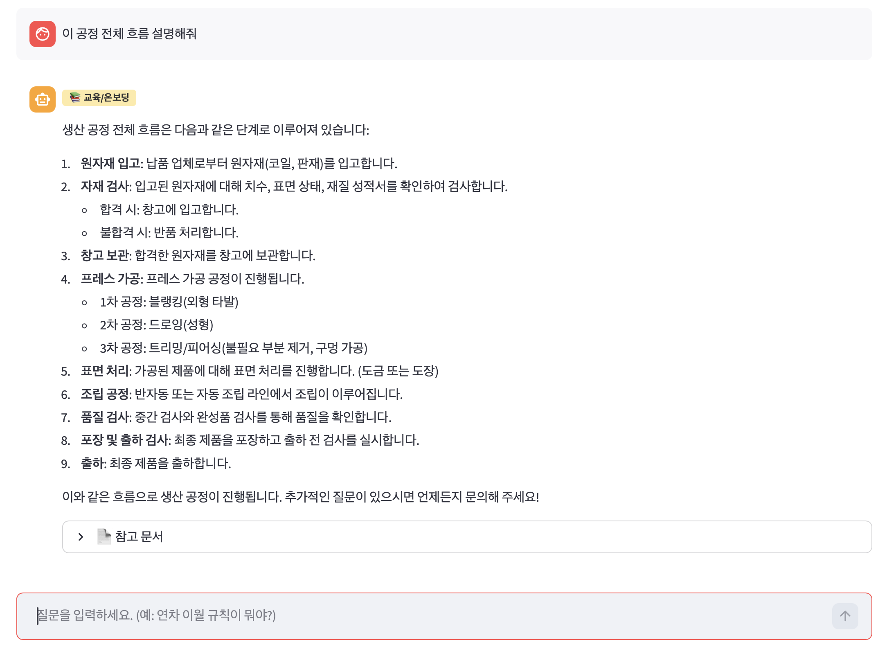

**입력:** "이 공정 전체 흐름 설명해줘"

- **라우팅 결과**: `교육/온보딩` 도메인으로 정확히 분류
- **답변 내용**: 생산 공정 9단계를 순차적으로 설명
  1. 원자재 입고 → 2. 자재 검사 → 3. 창고 보관 → 4. 프레스 가공(블랭킹/드로잉/트리밍) → 5. 표면 처리 → 6. 조립 공정 → 7. 품질 검사 → 8. 포장 및 출하 검사 → 9. 출하

---

### 2.6 현장 매뉴얼 도메인 테스트

#### 압력 이상 알람 조치 (`현장매뉴얼_1.png`)

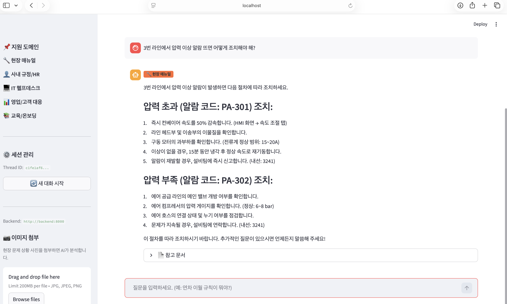

**입력:** "3번 라인에서 압력 이상 알람 뜨면 어떻게 조치해야 해?"

- **라우팅 결과**: `현장 매뉴얼` 도메인으로 정확히 분류
- **답변 내용**: 알람 코드별 조치 절차를 헤더로 구분하여 안내
  - PA-301(압력 초과): 컨베이어 50% 감속 → 이물질 확인 → 모터 과부하 확인(15~20A) → 15분 냉각 후 재기동 → 재발 시 설비팀 신고(내선 3241)
  - PA-302(압력 부족): 메인 밸브 개방 확인 → 에어 컴프레서 압게이지 확인(6~8 bar) → 에어 호스 점검
- **전체 UI 표시**: 좌측 사이드바(도메인 목록, 이미지 첨부)와 우측 채팅 영역이 함께 보이는 전체 레이아웃 캡처

---

#### A장비 필터 교체 주기 (`현장매뉴얼_2.png`)

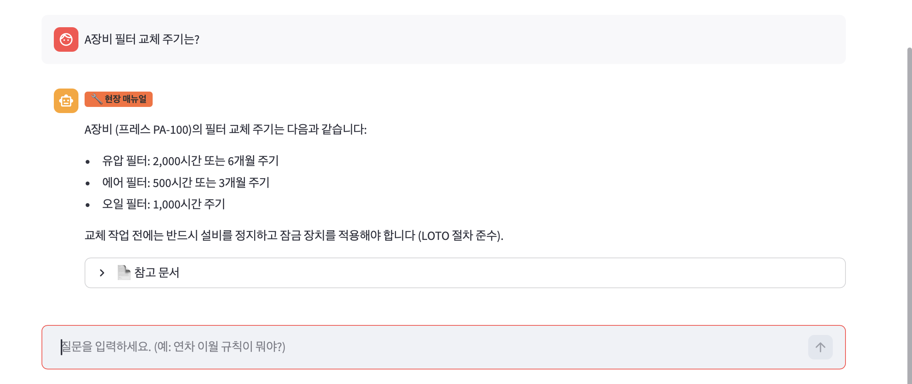

**입력:** "A장비 필터 교체 주기는?"

- **라우팅 결과**: `현장 매뉴얼` 도메인으로 정확히 분류
- **답변 내용**: A장비(프레스 PA-100) 필터 교체 주기를 종류별로 안내
  - 유압 필터: 2,000시간 또는 6개월
  - 에어 필터: 500시간 또는 3개월
  - 오일 필터: 1,000시간
  - 교체 작업 시 LOTO 절차 준수 안전 주의사항 포함

---

#### 에러 코드 E-204 (`현장매뉴얼_3.png`)

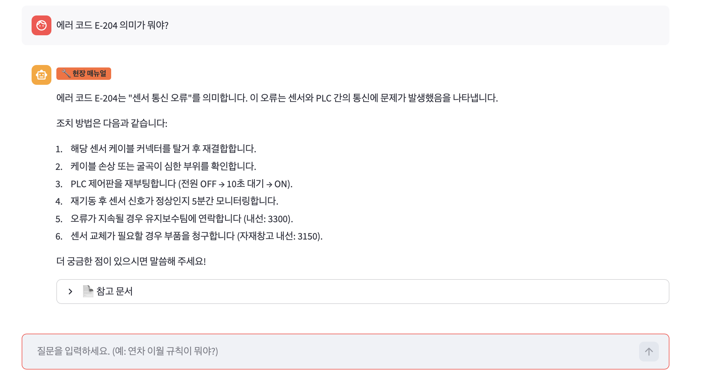

**입력:** "에러 코드 E-204 의미가 뭐야?"

- **라우팅 결과**: `현장 매뉴얼` 도메인으로 정확히 분류
- **답변 내용**: E-204가 "센서 통신 오류"(센서-PLC 간 통신 문제)임을 설명하고 6단계 조치 절차 안내
  1. 센서 케이블 커넥터 탈거 후 재결합
  2. 케이블 손상/굴곡 확인
  3. PLC 제어판 재부팅(OFF → 10초 대기 → ON)
  4. 재기동 후 5분간 신호 모니터링
  5. 지속 시 유지보수팀 연락(내선 3300)
  6. 센서 교체 필요 시 자재창고(내선 3150) 부품 청구

---
<!-- 직접 작성 -->

---

## 5. 어려웠던 점과 해결 방법

### a. 기술적 문제 및 해결 과정

**LLM 라우터 신뢰성 문제**
- 문제: LLM이 도메인 키 외에 부연 설명이나 잘못된 키워드를 반환하는 경우 발생
- 해결: System Prompt에서 도메인 키 하나만 출력하도록 강력히 제약하고, 유효하지 않은 응답이 오면 한국어 키워드 기반 폴백 함수로 재분류하는 이중 안전장치를 구현했다. 이를 통해 라우팅 정확도 100% 달성

**멀티모달 메시지 처리**
- 문제: 이미지가 포함된 메시지는 LangChain HumanMessage의 content가 리스트 타입으로 전달되어 기존 문자열 처리 로직이 실패
- 해결: 마지막 사용자 메시지를 역방향으로 탐색하면서 content 타입을 확인하고, 리스트인 경우 `type: "text"` 파트만 추출하는 `_get_last_human_text()` 헬퍼 함수를 별도로 구현

**멀티 도메인 벡터 DB 설계**
- 문제: 단일 Chroma 컬렉션에 모든 도메인 문서를 넣으면 도메인 간 노이즈 발생, 검색 품질 저하
- 해결: 도메인별로 독립 컬렉션을 구성하고, 라우터가 결정한 도메인의 컬렉션에서만 검색하도록 파이프라인을 설계하여 도메인 간 간섭을 완전히 제거

### b. 팀 협업 문제 및 해결 과정

개인 프로젝트로 팀 협업 이슈는 해당 없음

### c. 성능 문제 및 해결 과정

- 문제: 요청마다 Chroma 벡터 DB를 새로 로드하면서 첫 응답 이후에도 지연 발생
- 해결: `_retrievers` 딕셔너리를 모듈 레벨에서 유지하여 도메인별 검색기를 최초 1회만 초기화하고 이후 요청에서는 캐시에서 즉시 반환하는 구조로 개선. 응답 지연을 초기화 비용을 첫 요청에만 집중시켜 이후 응답 속도를 대폭 향상

---

## 6. 회고

### a. 배운 기술
- **LangGraph**: StateGraph를 활용한 멀티 노드 AI 파이프라인 설계. TypedDict 기반 상태 관리와 add_messages reducer를 통한 대화 이력 유지 방법을 익혔다.
- **RAG 아키텍처**: 문서 청킹 전략(크기, 오버랩)이 검색 품질에 미치는 영향을 직접 실험하며 최적값을 도출했다.
- **LLM 프롬프트 엔지니어링**: 라우터 LLM이 정확히 도메인 키만 출력하도록 System Prompt를 설계하는 과정에서 제약 조건 명시의 중요성을 체감했다.
- **멀티모달 LLM 연동**: Base64 인코딩을 통한 이미지-텍스트 동시 처리 방식과 LangChain 메시지 타입의 구조를 깊이 이해했다.
- **FastAPI + Streamlit 연동**: REST API 설계와 프론트엔드-백엔드 비동기 통신 구조를 직접 구현했다.
- **Docker Compose 헬스 체크**: 서비스 간 의존성(`depends_on` + `service_healthy`)을 설정하여 안정적인 기동 순서를 보장하는 방법을 배웠다.

### b. 개선할 점
- **스트리밍 응답**: 현재는 전체 답변이 완성된 후 한 번에 반환하는 구조로, LLM 스트리밍 API를 활용하면 체감 응답 속도를 크게 향상시킬 수 있다.
- **도메인 라우팅 신뢰도 표시**: 라우터의 분류 확신도(confidence)를 사용자에게 함께 표시하면 잘못된 라우팅 발생 시 사용자가 직접 도메인을 수정할 수 있어 UX가 향상된다.
- **지식 문서 관리 UI**: 현재는 파일 시스템에 직접 .txt 파일을 추가해야 지식 베이스가 갱신된다. 관리자가 웹에서 문서를 업로드·삭제할 수 있는 어드민 UI가 있으면 운영 편의성이 높아진다.
- **평가 파이프라인**: 라우팅 정확도와 답변 품질(관련성, 충실도)을 자동으로 측정하는 RAG 평가 파이프라인(예: RAGAS)을 구축하면 지속적인 품질 관리가 가능하다.

### c. 확장 가능성
- **신규 도메인 추가**: `knowledge/` 디렉토리에 새 폴더와 .txt 문서만 추가하면 자동으로 벡터 색인 및 라우팅이 되는 구조로 설계되어 도메인 확장이 용이하다.
- **에이전트 확장**: `tools.py`에 도메인별 RAG 도구가 이미 구현되어 있어 LangGraph 에이전트 아키텍처로의 전환이 용이하다.
- **공정 데이터 연동**: 현재 문서 기반 RAG에 MES·생산 DB 등 실시간 데이터를 추가하면 "이번 주 불량률 원인 분석" 같은 고급 질의도 지원 가능하다.
- **멀티테넌트 지원**: 부서별 독립 지식 베이스와 접근 권한 관리를 추가하면 대규모 기업 환경에 적용 가능하다.
- **보고서 자동 생성**: 축적된 대화 이력과 KPI 문서를 결합하면 관리자용 자동 보고서 생성 기능으로 확장 가능하다.

---

## 7. 참고 자료

### GitHub

https://github.com/kimnamhyeong01/enterprise-llm-rag-chatbot
